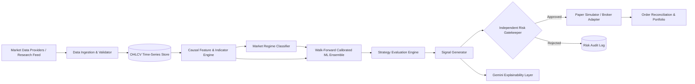
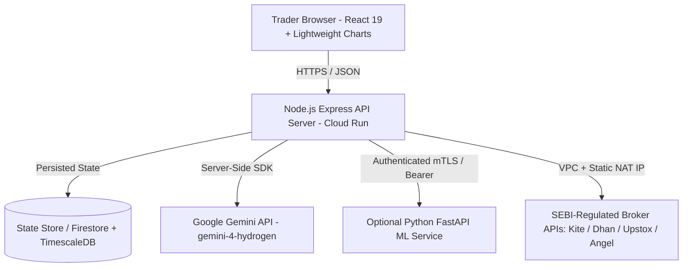
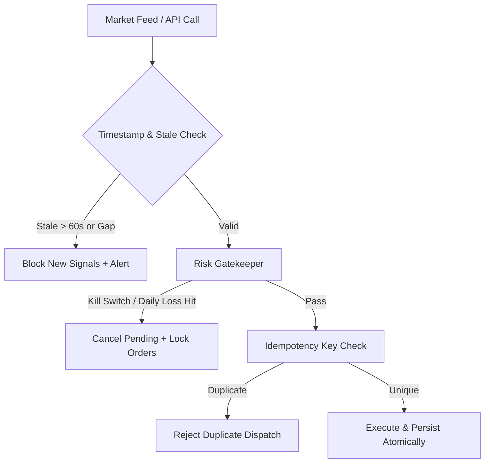

# System Architecture (`SYSTEM_ARCHITECTURE.md`)

## 1. High-Level Architectural Workflow

```mermaid
flowchart LR
  MDP[Market Data Providers / Research Feed] --> DI[Data Ingestion & Validator]
  DI --> TS[(OHLCV Time-Series Store)]
  TS --> FE[Causal Feature & Indicator Engine]
  FE --> MR[Market Regime Classifier]
  MR --> ML[Walk-Forward Calibrated ML Ensemble]
  FE --> ML
  ML --> SE[Strategy Evaluation Engine]
  SE --> SG[Signal Generator]
  SG --> RG{Independent Risk Gatekeeper}
  RG -->|Approved| EX[Paper Simulator / Broker Adapter]
  RG -->|Rejected| AL[(Risk Audit Log)]
  EX --> REC[Order Reconciliation & Portfolio]
  SG --> GEM[Gemini Explainability Layer]
```

## 2. System Context & Deployment Architecture

```mermaid
flowchart TB
  User[Trader Browser - React 19 + Lightweight Charts] -->|HTTPS / JSON| Node[Node.js Express API Server - Cloud Run]
  Node -->|Persisted State| Store[(State Store / Firestore + TimescaleDB)]
  Node -->|Server-Side SDK| Gemini[Google Gemini API - gemini-4-hydrogen]
  Node -->|Authenticated mTLS / Bearer| PyML[Optional Python FastAPI ML Service]
  Node -->|VPC + Static NAT IP| Broker[SEBI-Regulated Broker APIs: Kite / Dhan / Upstox / Angel]
```

## 3. Failure Recovery & Security Architecture

```mermaid
flowchart TD
  Feed[Market Feed / API Call] --> Val{Timestamp & Stale Check}
  Val -->|Stale > 60s or Gap| Safe[Block New Signals + Alert]
  Val -->|Valid| Risk[Risk Gatekeeper]
  Risk -->|Kill Switch / Daily Loss Hit| Halt[Cancel Pending + Lock Orders]
  Risk -->|Pass| Idem[Idempotency Key Check]
  Idem -->|Duplicate| Ignore[Reject Duplicate Dispatch]
  Idem -->|Unique| Exec[Execute & Persist Atomically]
```
